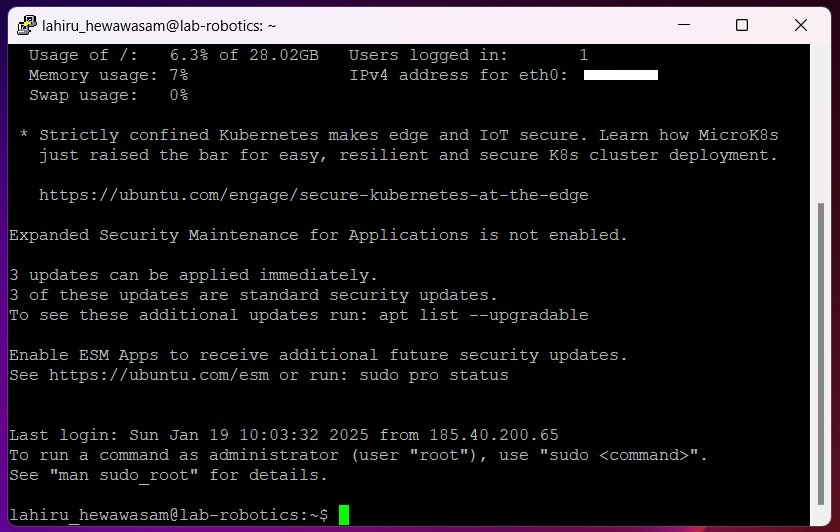

# Linux Management 

This repository created to update weekly course progress of Linux Management in ICT Robotics (BEIRP24A6)

## Assingment 1

### Azure Virtual Machine Setup

#### Initial Setup
1. Used existing personal GitHub account
2. Linked HAMK student email to personal GitHub account through Settings > Emails

#### Azure Account Setup
1. Created Azure account using HAMK student email at portal.azure.com
2. Activated Azure for Students subscription for additional credits

#### Virtual Machine Creation

##### Machine Specifications:
- **Image**: Ubuntu Server 24.04 LTS gen 2 (Canonical)
- **Name**: Ubuntu1-tja-NEur-B1s
- **Size**: Standard_B2ls_v2
- **Authentication**: SSH key
- **Network**: New resource group and subnet created
- **Security**: Configured to allow SSH traffic from specified IP


### SSH Connection Setup with PuTTY

#### Converting .PEM to .PPK
1. Launched PuTTYgen from Start menu
2. Selected RSA as the key type
3. Clicked 'Load' and changed file filter to 'All Files'
4. Located and selected the .pem file from Azure
5. Clicked 'Save private key'
6. Confirmed saving without passphrase
7. Saved the converted key with .ppk extension


#### Establishing SSH Connection
1. Opened PuTTY
2. Entered VM's public IP address in the Host Name field
3. Navigated to Connection > SSH > Auth
4. Browsed and selected the converted .ppk key file
5. Clicked 'Open' to start the session
6. Successfully connected to the VM using the specified username



#### Connection Verification
- Successfully logged into the Ubuntu VM shell
- Verified system access and basic functionality
- System settings left at default as per instructions

### Notes
- VM created according to Microsoft Azure course specifications
- All security best practices followed
- SSH key authentication used for enhanced security

## Assingment 2

The task involves selecting five level 2 directories and saving their contents in a file named "listing.md." A level 2 directory is defined as a directory that is two levels deep within the file system, such as /home/mylogin/. Examples of directories that do not qualify as level 2 include /tmp/ (level 1) and /usr/local/bin/ (level 3).

For each of the five selected level 2 directories, the contents should be listed, which involves listing the filenames within each directory. The resulting file, "listing.md," will contain the directory paths along with their respective filenames.

``` bash
sudo ls /etc/{security,selinux,systemd,sos,ssh} > listing.md
```


Download [here](assets/assigment-2.md)

## Assingment 3

This document details the process of creating users and managing permissions in a Linux environment. The tasks include creating different types of users, managing sudo privileges, and setting up a shared directory with specific permissions.

### Task 1: Creating User Tupu

The adduser script was used to create the Tupu user. This script provides an interactive way to create a new user with all necessary directories and settings.

``` bash
sudo adduser tupu
```


The adduser script automatically:
- Creates the home directory
- Sets up default shell
- Prompts for password
- Creates user-specific group
- Sets up basic profile

### Task 2: Creating User Lupu

Initially, I tried using the following given command:

``` bash
sudo useradd -m -d /home/lupu -s /bin/bash -G lupu lupu
```

However, this resulted in an error:


The issue was that we tried to add the user to a group that didn't exist yet. To fix this, we modified the command to include the -U flag, which automatically creates a user group with the same name as the user:

``` bash
sudo useradd -m -d /home/lupu -s /bin/bash -U lupu
```


After creation, Set the password:

``` bash
sudo passwd lupu
```


### Task 3: Creating System User Hupu

Created a system user Hupu with restricted login capabilities:

``` bash
sudo useradd --system --shell /bin/false hupu
```


This creates a system account that:

- Has no login shell (/bin/false)
- Is typically used for running services
- Has no home directory by default

### Task 4: Adding Sudo Privileges

Added sudo privileges for both Tupu and Lupu users using the usermod command:

``` bash
sudo visodu
```

Then adding:

``` bash
tupu ALL=(ALL:ALL) ALL
lupu ALL=(ALL:ALL) ALL
```


Alternative method using:

``` bash
sudo usermod -aG sudo tupu
sudo usermod -aG sudo lupu
```


### Task 5: Setting Up Shared Directory

This task required creating a shared directory with specific permissions for Tupu and Lupu. Here's the detailed solution:

1. First, created a new group for the shared directory:

``` bash
sudo groupadd projekti
```

2. Created the directory:

``` bash
sudo mkdir /opt/projekti
```

3. Added Tupu and Lupu to the projekti group:

``` bash
sudo usermod -aG projekti tupu
sudo usermod -aG projekti lupu
```

4. Set group ownership and permissions:

``` bash
sudo chown :projekti /opt/projekti
sudo chmod 2770 /opt/projekti
```


The permission setup (2770) breaks down as:

- 2: SetGID bit (ensures new files inherit group ownership)
- 7: Owner has full permissions (read/write/execute)
- 7: Group has full permissions (read/write/execute)
- 0: Others have no permissions

This configuration ensures:

- Only Tupu and Lupu can access the directory
- New files automatically inherit the projekti group
- Other users cannot access the directory
- Both users have full control over the directory and its contents

To verify the setup:

``` bash
sudo ls -la /opt/projekti
```

