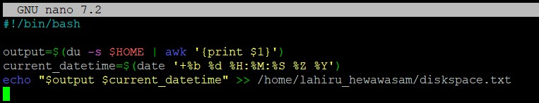
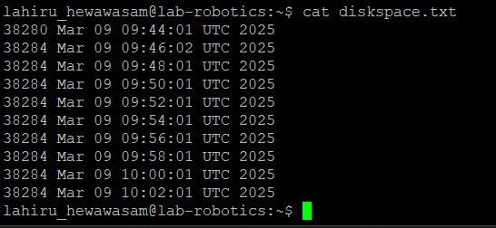
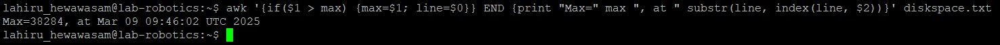
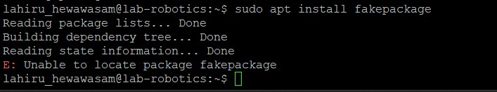
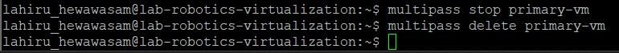

# Linux Management 

This repository created to update weekly course progress of Linux Management in ICT Robotics (BEIRP24A6)

## Assingment 1

### Azure Virtual Machine Setup

#### Initial Setup
1. Used existing personal GitHub account
2. Linked HAMK student email to personal GitHub account through Settings > Emails

#### Azure Account Setup
1. Created Azure account using HAMK student email at portal.azure.com
2. Activated Azure for Students subscription for additional credits

#### Virtual Machine Creation

##### Machine Specifications:
- **Image**: Ubuntu Server 24.04 LTS gen 2 (Canonical)
- **Name**: Ubuntu1-tja-NEur-B1s
- **Size**: Standard_B2ls_v2
- **Authentication**: SSH key
- **Network**: New resource group and subnet created
- **Security**: Configured to allow SSH traffic from specified IP


### SSH Connection Setup with PuTTY

#### Converting .PEM to .PPK
1. Launched PuTTYgen from Start menu
2. Selected RSA as the key type
3. Clicked 'Load' and changed file filter to 'All Files'
4. Located and selected the .pem file from Azure
5. Clicked 'Save private key'
6. Confirmed saving without passphrase
7. Saved the converted key with .ppk extension


#### Establishing SSH Connection
1. Opened PuTTY
2. Entered VM's public IP address in the Host Name field
3. Navigated to Connection > SSH > Auth
4. Browsed and selected the converted .ppk key file
5. Clicked 'Open' to start the session
6. Successfully connected to the VM using the specified username


#### Connection Verification
- Successfully logged into the Ubuntu VM shell
- Verified system access and basic functionality
- System settings left at default as per instructions

### Notes
- VM created according to Microsoft Azure course specifications
- All security best practices followed
- SSH key authentication used for enhanced security

## Assingment 2

The task involves selecting five level 2 directories and saving their contents in a file named "listing.md." A level 2 directory is defined as a directory that is two levels deep within the file system, such as /home/mylogin/. Examples of directories that do not qualify as level 2 include /tmp/ (level 1) and /usr/local/bin/ (level 3).

For each of the five selected level 2 directories, the contents should be listed, which involves listing the filenames within each directory. The resulting file, "listing.md," will contain the directory paths along with their respective filenames.

``` bash
sudo ls /etc/{security,selinux,systemd,sos,ssh} > listing.md
```


Download [here](assets/assigment-2.md)

## Assingment 3

This document details the process of creating users and managing permissions in a Linux environment. The tasks include creating different types of users, managing sudo privileges, and setting up a shared directory with specific permissions.

### Task 1: Creating User Tupu

The adduser script was used to create the Tupu user. This script provides an interactive way to create a new user with all necessary directories and settings.

``` bash
sudo adduser tupu
```


The adduser script automatically:
- Creates the home directory
- Sets up default shell
- Prompts for password
- Creates user-specific group
- Sets up basic profile

### Task 2: Creating User Lupu

Initially, I tried using the following given command:

``` bash
sudo useradd -m -d /home/lupu -s /bin/bash -G lupu lupu
```

However, this resulted in an error:


The issue was that we tried to add the user to a group that didn't exist yet. To fix this, we modified the command to include the -U flag, which automatically creates a user group with the same name as the user:

``` bash
sudo useradd -m -d /home/lupu -s /bin/bash -U lupu
```


After creation, Set the password:

``` bash
sudo passwd lupu
```


### Task 3: Creating System User Hupu

Created a system user Hupu with restricted login capabilities:

``` bash
sudo useradd --system --shell /bin/false hupu
```


This creates a system account that:

- Has no login shell (/bin/false)
- Is typically used for running services
- Has no home directory by default

### Task 4: Adding Sudo Privileges

Added sudo privileges for both Tupu and Lupu users using the usermod command:

``` bash
sudo visodu
```

Then adding:

``` bash
tupu ALL=(ALL:ALL) ALL
lupu ALL=(ALL:ALL) ALL
```


Alternative method using:

``` bash
sudo usermod -aG sudo tupu
sudo usermod -aG sudo lupu
```


### Task 5: Setting Up Shared Directory

This task required creating a shared directory with specific permissions for Tupu and Lupu. Here's the detailed solution:

**First, created a new group for the shared directory:**

``` bash
sudo groupadd projekti
```

**Created the directory:**

``` bash
sudo mkdir /opt/projekti
```

**Added Tupu and Lupu to the projekti group:**

``` bash
sudo usermod -aG projekti tupu
sudo usermod -aG projekti lupu
```

**Set group ownership and permissions:**

``` bash
sudo chown :projekti /opt/projekti
sudo chmod 2770 /opt/projekti
```


The permission setup (2770) breaks down as:

- 2: SetGID bit (ensures new files inherit group ownership)
- 7: Owner has full permissions (read/write/execute)
- 7: Group has full permissions (read/write/execute)
- 0: Others have no permissions

This configuration ensures:

- Only Tupu and Lupu can access the directory
- New files automatically inherit the projekti group
- Other users cannot access the directory
- Both users have full control over the directory and its contents

To verify the setup:

``` bash
sudo ls -la /opt/projekti
```


## Assingment 5

In this assignment, we created a shell script called print.sh to add a line to the file diskspace.txt, reporting the home directory size and the current date and time. We then used crontab to schedule this script to run every 12 hours, ensuring it runs at least six times to populate diskspace.txt with multiple entries. Finally, we utilized an awk command to find the line with the maximum value in the first column and printed it in the format: Max=[maximum value], at [date and time]. This task helped us automate the process of monitoring disk space and identifying the largest recorded value efficiently.

### Step 1: Make a script and add it to cron

**Script: `print.sh`**

This script adds a line to the file `diskspace.txt`, reporting the home directory size and the current date.

``` bash
#!/bin/bash

output=$(ls -l / | grep home | awk '{print $5}')
current_datetime=$(date)
echo "$output $current_datetime" >> /home/lahiru_hewawasam/discspace.txt
```



**Add to Cron**

Use the following command to open your crontab file:

``` bash
crontab -e
```

Add the following line to run the print.sh script every 12 hours:

``` bash
0 */12 * * * /home/lahiru_hewawasam/print.sh
```


**Note: For ease of testing I raned it in every 2 minutes ( \*/2 * * * * )**

### Step 2: Run the script a minimum of 6 times

After adding the script to cron, it will automatically run every 12 hours, adding a line to diskspace.txt each time. Ensure that it runs at least 6 times so that the file contains at least 6 lines.



### Step 3: Find and print the line containing the maximum size

Use the following awk command to find the line with the maximum size and print it in the specified format:

``` bash
awk 'NR == 1 || $1 > max { max = $1; max_line = $0 } END { print "Max=" max ", at " substr(max_line, index(max_line, $2)) }' /home/lahiru_hewawasam/discspace.txt
```



### Explanation

#### Script (print.sh):

- output=$(ls -l / | grep home | awk '{print $5}'): Get the size of the home directory.
- awk '{print $5}': Extract the size part.
- current_datetime=$(date): Get the current date and time and stored in the variable current_datetime.
- echo "$output $current_datetime" >> /home/lahiru_hewawasam/discspace.txt: Append the output to diskspace.txt.

#### Cron:

- 0 */12 * * *: Run the script every 12 hours. 

**Note: For ease of testing I raned it in every 2 minutes ( \*/2 * * * * )**

#### awk command:

- NR == 1 || $1 > max { max = $1; max_line = $0 }: Find the maximum value in the first column.
- END { print "Max=" max ", at " substr(max_line, index(max_line, $2)) }: Print the maximum value and the corresponding row in the desired format.

## Assingment 6

This report documents the hands-on exploration of the Advanced Package Tool (APT) on a Linux system, covering system updates, package management, repository handling, and troubleshooting procedures.

### Part 1: Understanding APT & System Updates

**APT Version Check**

Command executed:
``` bash
apt --version
```

Output:


**Package List Update**

Command executed:
``` bash
sudo apt update
```

This step is important because:

- It synchronizes the local package index with the remote repositories
- Ensures the system has the latest information about available packages
- Required before performing any package installations or upgrades
- Helps identify which packages need updates

**System Upgrade**

Command executed:
``` bash
sudo apt upgrade -y
```

Difference between update and upgrade:

- apt update only refreshes the package index and metadata
- apt upgrade actually downloads and installs newer versions of installed packages
- update is like checking what's new, while upgrade is actually getting those new versions

**Pending Updates Check**

Command executed:
``` bash
apt list --upgradable
```

Output:


### Part 2: Installing & Managing Packages

**Package Search**

Command executed:
``` bash
apt search image editor
```

*Selected package: gimp (GNU Image Manipulation Program)*

**Package Details**

Command executed:
``` bash
apt show gimp
```

Output:


Key dependencies:

- libc6
- libgdk-pixbuf2.0-0
- libgegl-0.4-0t64
- libgimp2.0t64
- libgtk2.0-0t64

**Package Installation**

Command executed:
``` bash
sudo apt install gimp -y
```

*Installation was successful, verified by launching the application.*

**Version Check**

Command executed:
``` bash
apt list --installed | grep gimp
```

Output:


### Part 3: Removing & Cleaning Packages

Package Removal

Command executed:
``` bash
sudo apt remove gimp -y
```

*Note: This removes the package but keeps configuration files.*

**Complete Package Purge**

Command executed:
``` bash
sudo apt purge gimp -y
```

Difference between remove and purge:

- remove only uninstalls the package binaries
- purge removes both the binaries and configuration files
- purge is more thorough when you want to completely remove all traces of a package

**Autoremove Unused Dependencies**

Command executed:
``` bash
sudo apt autoremove -y
```

This step is important because:

- Removes packages that were installed as dependencies but are no longer needed
- Frees up disk space
- Keeps the system clean from unused software

**Clean Package Cache**

Command executed:
``` bash
sudo apt clean
```

This command:

- Removes all downloaded package files (.deb) from the local cache
- Frees up disk space in /var/cache/apt/archives/
- Doesn't affect installed packages

### Part 4: Managing Repositories & Troubleshooting

**Repository List**

Command executed:
``` bash
cat /etc/apt/sources.list
```

Output:


Observations:

- Contains main Ubuntu repositories
- Includes different components (main, restricted, universe, multiverse)
- Lists both source and binary package repositories
- Contains security updates repositories

**Adding Universe Repository**

Command executed:
``` bash
sudo add-apt-repository universe
sudo apt update
```

Output:


Universe repository contains:

- Community-maintained packages
- Open-source software not officially supported by Ubuntu
- Larger selection of packages compared to main repository
- Software that may have more frequent updates

**Installation Failure Simulation**

Command executed:
``` bash
sudo apt install fakepackage
```

Error message:



Troubleshooting steps:

1. Verify package name spelling
2. Check if the required repository is enabled
3. Run apt update to refresh package lists
4. Search for similar package names using apt search
5. Consider using alternative package names or sources

### Bonus Challenge: Package Hold Management

Commands executed:
``` bash
sudo apt-mark hold firefox
sudo apt-mark unhold firefox
```


Reasons to hold a package:

- Prevent automatic updates of critical production software
- Maintain specific version compatibility with other software
- Avoid potential breaking changes from updates
- Keep a stable working environment for specific applications

### Conclusion

Through this assignment, we've gained practical experience with APT package management, including:

- System updates and upgrades
- Package installation and removal
- Repository management
- Troubleshooting common issues
- Advanced package management techniques

These skills are fundamental for maintaining and managing Linux systems effectively.

## Assingment 7

### Linux Virtualization Exercise

### Part 1: Virtualization Concepts

#### Key Concepts Overview

**Virtualization**

Virtualization is a technology that allows the creation of virtual versions of computing resources, including hardware platforms, storage devices, and network resources. It enables multiple virtual systems to run on a single physical machine.

**Hypervisor**

A hypervisor (or Virtual Machine Monitor) is software that creates and manages virtual machines. There are two types:

Type 1 (Bare Metal): Runs directly on hardware (e.g., VMware ESXi, Xen)
Type 2 (Hosted): Runs on top of an operating system (e.g., VirtualBox, VMware Workstation)

**Virtual Machines (VMs)**

VMs are complete virtualized computing environments that include their own:

- Operating system
- Virtual hardware (CPU, RAM, storage, network interfaces)
- Isolated system resources

**Containers**

Containers are lightweight, portable environments that package application code and dependencies. They:

- Share the host OS kernel
- Are more resource-efficient than VMs
- Start up faster and are more portable

#### VMs vs. Containers Comparison

**Architecture**

- VMs: Complete isolation with dedicated kernel and resources
- Containers: Shared kernel with isolated user space

**Resource Utilization**

- VMs: Higher overhead due to running complete OS
- Containers: Lower overhead, shares host OS resources

**Isolation Level**

- VMs: Complete hardware-level isolation
- Containers: Process-level isolation

### Part 2: Multipass Implementation

#### Installation

``` bash
# Install Multipass
sudo snap install multipass
```

#### Basic Commands Implementation

```bash
# Launch default Ubuntu instance
multipass launch --name primary-vm
```


```bash
# List running instances
multipass list
```


```bash
# View instance details
multipass info primary-vm
```


```bash
# Access instance shell
multipass shell primary-vm
```


```bash
# Execute command on instance
multipass exec primary-vm -- ls -la
```


```bash
# Stop instance
multipass stop primary-vm

# Delete instance
multipass delete primary-vm
```


#### Cloud-init Configuration

**Start a New Instance with Multipass**


To start a new instance using this cloud-init configuration, you can use the following multipass command:

```bash
multipass launch --name my-instance --cloud-init cloud-init
```

#### File sharing

```bash
# Create shared directory
mkdir ~/shared-folder

# Mount to instance
multipass mount ~/shared-folder my-instance:/shared
```

### Part 3: LXD Implementation

```bash
# Create container
lxc launch ubuntu:20.04 my-container

# List containers
lxc list

# Execute commands
lxc exec my-container -- apt update

# Stop container
lxc stop my-container

# Delete container
lxc delete my-container
```


### Part 4: Docker Implementation

#### Installation

```bash
# Install Docker Engine
sudo apt update
sudo apt install docker.io

# Start and enable Docker
sudo systemctl start docker
sudo systemctl enable docker
```

Basic Docker Commands

```bash
# Pull image
docker pull ubuntu:latest

# Run container
docker run -it ubuntu:latest

# List containers
docker ps

# Build from Dockerfile
docker build -t myapp .

# Stop container
docker stop container_id
```


### Part 5: Snap Implementation

#### Creating a Basic Snap


#### Build and install

```bash
# Build snap
snapcraft

# Install locally
sudo snap install my-app_1.0_amd64.snap --dangerous
```
